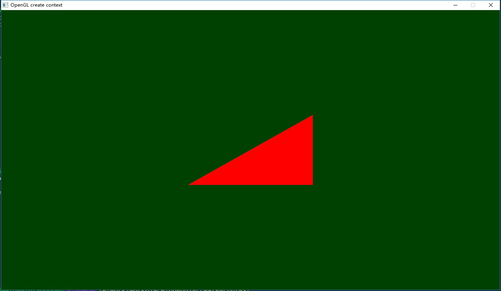

## Create OpenGL context without framework on Windows

I learn from this [blog](https://mariuszbartosik.com/opengl-4-x-initialization-in-windows-without-a-framework/) and he's [project](https://github.com/Lazarus247/project247). You can read detail from that blog.

The below are OpenGL documents:

* [OpenGL Getting Started](https://www.khronos.org/opengl/wiki/Getting_Started)
* [Creating OpenGL Context](https://www.khronos.org/opengl/wiki/Creating_an_OpenGL_Context)
* [Load OpenGL Functions](https://www.khronos.org/opengl/wiki/Load_OpenGL_Functions)
* [API and Extension Header Files ](https://www.khronos.org/registry/OpenGL/index_gl.php)

## What's inside this project

* absolutely model OpenGL with version 4.x and use [`<GL/glcorearb.h>`](https://www.khronos.org/registry/OpenGL/index_gl.php) instead of `<GL/gl.h>` and `<GL/glext.h>`.
* compared to the [project](https://github.com/Lazarus247/project247) above, this project use draw commands to draw an triangle.
* this project is based on [msys2](https://www.msys2.org/), sorry now, I don't provide solution for visual studio.

## How to compile

* download [msys2](https://www.msys2.org/), need `gcc`.
* then just `make`.
* run `main.exe`.

This is the runtime screenshot:

